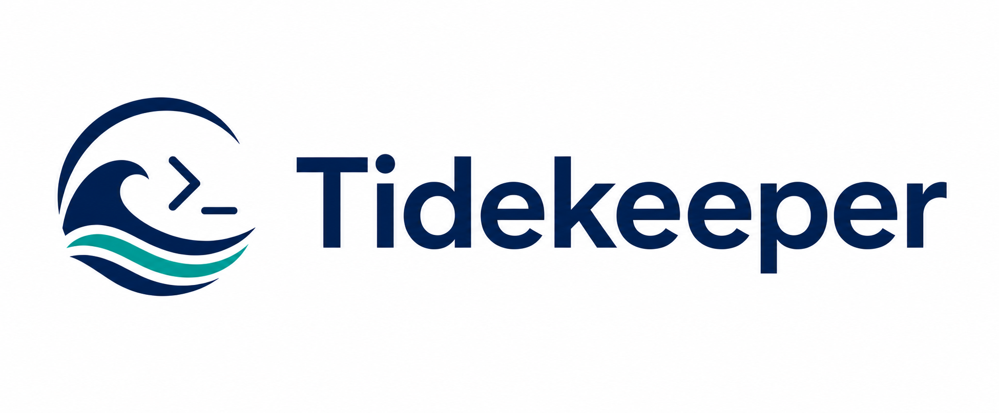

# Tidekeeper CLI

Tidekeeper CLI is an unofficial maintained fork of
[yaronzz/Tidal-Media-Downloader](https://github.com/yaronzz/Tidal-Media-Downloader),
focused on keeping the Python command-line tool installable, testable, and usable
on current Python versions.

The CLI is available as both `tidekeeper` and the legacy-compatible `tidal-dl`.

[](https://github.com/OpenNerdz/tidekeeper-cli/actions/workflows/ci.yml)
[](https://github.com/OpenNerdz/tidekeeper-cli/actions/workflows/build.yml)
[](LICENSE)

## Scope

- Maintain the Python CLI fork with modern packaging and CI.
- Improve install reliability, authenticated API requests, retries, partial files,
  timeouts, and error reporting.
- Keep compatibility with existing `tidal-dl` workflows where practical.

This project does not aim to bypass access controls, subscription checks, or DRM.

## Install

```bash
python -m pip install "git+https://github.com/OpenNerdz/tidekeeper-cli.git#subdirectory=TIDALDL-PY"
```

Linux one-command installer:

```bash
curl -fsSL https://raw.githubusercontent.com/OpenNerdz/tidekeeper-cli/main/install.sh | bash
```

Then run:

```bash
tidekeeper
```

## Termux

Termux support is for the CLI install path only.

```bash
pkg update && pkg upgrade -y && pkg install -y curl
curl -fsSL https://raw.githubusercontent.com/OpenNerdz/tidekeeper-cli/main/install.sh | bash
tidekeeper
```

To save downloads to Android shared storage:

```bash
termux-setup-storage
export TIDEKEEPER_DOWNLOAD_PATH="/storage/emulated/0/Download/Tidekeeper"
```

If `ffmpeg` fails with `cannot locate symbol "x265_api_get_216"`, your Termux
packages are mismatched. Run:

```bash
pkg update
pkg upgrade -y
pkg reinstall -y ffmpeg x265
ffmpeg -version
```

If it still fails, run `termux-change-repo`, switch mirrors, then repeat the
commands above.

## Usage

```bash
tidekeeper --help
tidekeeper --doctor
tidekeeper
tidekeeper -l "https://tidal.com/browse/track/70973230"
```

`tidekeeper --doctor` checks the saved client, token, download path, and local
tools without starting a download.

Dolby Atmos downloads are opt-in:

```bash
tidekeeper -q Atmos
tidekeeper -l "https://tidal.com/browse/album/123456"
```

When an Atmos stream is downloaded, the default track filename gets a
`[Dolby Atmos]` suffix. Custom track filename formats can also use
`{StreamQuality}` and `{Codec}`, for example:

```text
{TrackNumber} - {ArtistName} - {TrackTitle} [{StreamQuality}] [{Codec}]
```

If TIDAL blocks a requested stream manifest or the requested format is not
available for a track, Tidekeeper falls back through lower audio qualities so
the download can continue when another entitled format is available. Track
output shows the requested quality and the fallback quality when this happens.

If a track download fails, Tidekeeper appends it to `failed-tracks.txt` in the
download folder. The file keeps comments with the title and reason, followed by
a plain TIDAL track URL. Retry those tracks later with:

```bash
tidekeeper -l "/path/to/downloads/failed-tracks.txt"
```

Legacy command:

```bash
tidal-dl --help
```

## Desktop GUI

The modern desktop GUI is optional and uses PySide6/Qt so the CLI install stays
lightweight.

```bash
python -m pip install "tidekeeper-cli[gui] @ git+https://github.com/OpenNerdz/tidekeeper-cli.git#subdirectory=TIDALDL-PY"
tidekeeper-gui
```

From a local checkout:

```bash
cd tidekeeper-cli/TIDALDL-PY
python -m pip install -e ".[gui]"
tidekeeper-gui
```

The GUI is also available through the legacy-compatible CLI flag:

```bash
tidekeeper --gui
```

The desktop app exposes the same operational controls as the CLI: device login,
manual token login, logout, direct URL/ID/text-file downloads, search, queueing,
download path and format settings, quality settings, option toggles, language,
TIDAL client selection, and doctor diagnostics.

To validate the desktop UI without a login or network calls, run the automated
screenshot smoke test. It renders every GUI screen with demo data and verifies
that each capture is nonblank and correctly sized.

```bash
cd tidekeeper-cli/TIDALDL-PY
python scripts/gui_screenshots.py
```

## Development

See [CONTRIBUTING.md](CONTRIBUTING.md) for pull request guidelines and the
expected local checks. See [CHANGELOG.md](CHANGELOG.md) for release history.

```bash
git clone https://github.com/OpenNerdz/tidekeeper-cli.git
cd tidekeeper-cli/TIDALDL-PY
python -m venv .venv
source .venv/bin/activate
python -m pip install --upgrade pip
python -m pip install -e .
python -m compileall -q tidal_dl
python -m unittest discover -s tests
```

## Build

```bash
./build.sh
```

Build outputs are written under `TIDALDL-PY/dist` and `TIDALDL-PY/exe`.

## Attribution

This project is based on `yaronzz/Tidal-Media-Downloader`, originally authored
by YaronH and contributors. The original project is licensed under Apache-2.0.
See [NOTICE](NOTICE) and [LICENSE](LICENSE).

## Disclaimer

This project is unofficial and is not affiliated with, endorsed by, or sponsored
by TIDAL or Block, Inc. Use it only where you have the right to do so, and follow
the laws and service terms that apply in your location.

## Security

Please report security-sensitive issues privately and redact tokens from logs.
See [SECURITY.md](SECURITY.md) for details.
